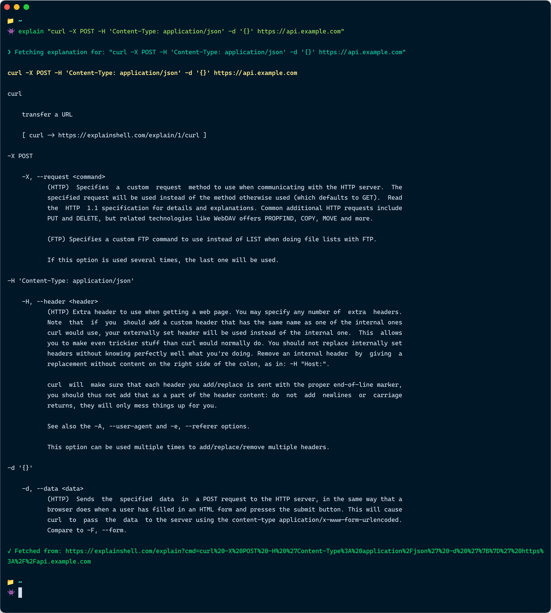

# explainshell-cli

The missing CLI for [explainshell.com](https://explainshell.com).

## What It Does

`explainshell-cli` takes any shell command as input and retrieves a detailed explanation from [explainshell.com](https://explainshell.com), breaking down each part of the command with its corresponding documentation in a CLI-friendly way.

## Example



## Installation

_NOTE: only installation **from source** is available as of right now - I'm working on Homebrew and npm._

### Using Homebrew (recommended) (not yet available)

```bash
brew install mjsarfatti/tap/explainshell-cli
```

### Using npm (not yet available)

```bash
npm install -g explainshell-cli
```

This will symlink the `explain` command globally, making it available from anywhere in your terminal.

### From Source

```bash
git clone https://github.com/mjsarfatti/explainshell-cli.git
cd explainshell-cli
npm install
npm run build
npm link
```

## Usage

Run the `explain` command followed by the shell command you want to understand:

```bash
explain "ls -la"
```

```bash
explain "tar -xzvf archive.tar.gz"
```

```bash
explain "find . -name '*.js' -type f -exec grep -l 'console.log' {} \;"
```

```bash
explain "curl -X POST -H 'Content-Type: application/json' -d '{}' https://api.example.com"
```

For commands with pipes or special characters, make sure to quote them:

```bash
explain "ps aux | grep node | awk '{print \$2}'"
```

### Output:

The tool will display a formatted explanation showing:

- Each command part and its flags
- Detailed help text from the man pages
- Links to expanded documentation for complex expressions

## Development

```bash
# Install dependencies
npm install

# Build the project
npm run build

# Run tests
npm test

# Development mode with auto-reload
npm run dev
```

## How It Works

1. Takes your command as input
2. Queries explainshell.com's API
3. Parses the HTML response
4. Formats and displays the explanation in a clean, readable format
5. Groups related command parts together with their documentation

## Acknowledgments

**Huge thanks to [Idan Kamara](https://github.com/idank), and his [explainshell.com](https://explainshell.com)!** This tool would obviously not exist without their work in building and maintaining the explainshell.com service.

## License

MIT

## Contributing

Contributions are welcome! Feel free to open issues or submit pull requests. Please make sure any bug- or feature-related PR is accompanied by appropriately revised or augmented tests.
